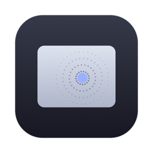
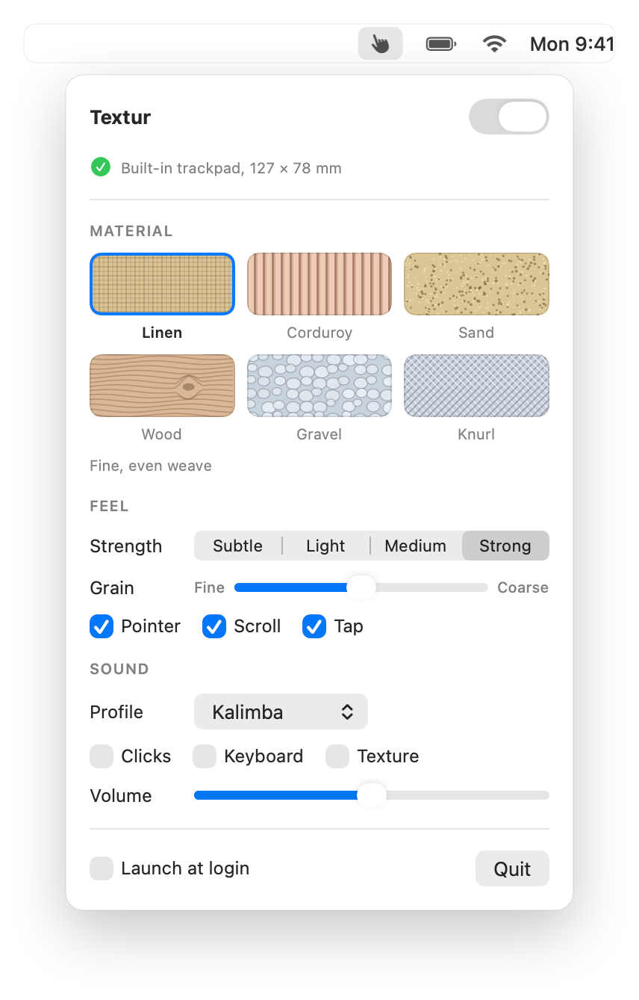

<p align="center">
  
</p>

<h1 align="center">HapticPad</h1>

<p align="center">
  <b>Feel textures under your finger.</b><br>
  Your Mac's trackpad turns into linen, wood or gravel as you move, scroll and tap.<br>
  Free, open source, native to macOS.
</p>

<p align="center">
  <a href="https://github.com/adrbn/hapticpad/releases/latest/download/HapticPad.dmg"></a>
  &nbsp;
  <a href="https://ko-fi.com/adrbn"></a>
  &nbsp;
  <a href="https://github.com/adrbn/hapticpad/issues/new"></a>
</p>

<p align="center">
  <a href="https://github.com/adrbn/hapticpad/releases/latest"></a>
  
  
  <a href="./LICENSE"></a>
</p>

<p align="center">
  <picture>
    <source media="(prefers-color-scheme: dark)" srcset="docs/assets/hero-dark.png">
    
  </picture>
</p>

<p align="center">
  <a href="#get-started">Get started</a> ·
  <a href="#materials">Materials</a> ·
  <a href="#faq">FAQ</a> ·
  <a href="#support-hapticpad">Support</a>
</p>

---

## Why HapticPad

- 🧵 **Six materials that feel different.** Each one has its own grain spacing, irregularity and direction: corduroy ridges only show up when you move sideways, wood has the odd knot, gravel is sparse and uneven.
- 📏 **It follows your finger, not the pointer.** Grains are placed by how far your finger actually travels on the glass, in millimetres, so the texture stays put whatever your tracking speed.
- 🎚️ **Two controls, that's it.** Strength for how hard each grain hits, Grain for how far apart they sit. Pointer, scroll and tap each have their own switch.
- 🔊 **Optional sounds.** Soft synthesized clicks and key sounds in four profiles: Kalimba, Muted, Mechanical and Droplet. Off until you turn them on.
- 🔒 **Nothing leaves your Mac.** No account, no network access, no telemetry. HapticPad has no network code at all.
- 💸 **Free, with no paid tier.** Every material and every sound. About 2 MB, signed and notarized, and the code is open source (MIT).

## Get started

1. **[Download HapticPad](https://github.com/adrbn/hapticpad/releases/latest/download/HapticPad.dmg)**, open the `.dmg` and drag HapticPad to Applications.
2. **Open it.** A hand appears in the menu bar; there's no Dock icon and no window.
3. **Rest a finger on the trackpad** and pick a material. You feel a short preview right away, then the texture follows you as you move.

> [!TIP]
> Turn on **Launch at login** at the bottom of the panel and forget about it.

> [!NOTE]
> **Keyboard sounds** need Input Monitoring (**System Settings ▸ Privacy & Security ▸ Input Monitoring**). HapticPad only checks which kind of key was pressed (a letter, space, return, delete), never what you type.

## Materials

| Material | Feels like |
| --- | --- |
| **Linen** | A fine, even weave, with a slightly stronger thread every few grains |
| **Corduroy** | Ridges that are pronounced sideways and almost smooth up and down |
| **Sand** | Dense, irregular fine grain with the odd coarser speck |
| **Wood** | Grain lines, strongest across the grain, and now and then a knot |
| **Gravel** | Sparse, rounded stones of uneven size |
| **Knurl** | A crisp, regular machined diamond grid |

**Strength** goes from Subtle to Strong. **Grain** stretches or tightens the spacing of every material, from Fine to Coarse.

| Input | What you feel |
| --- | --- |
| **Pointer** | The material under one finger as it moves |
| **Scroll** | The same material under two fingers, with wider grains so fast scrolls don't blur |
| **Tap** | A light tick each time a finger lands, so taps can be felt |

## FAQ

<details>
<summary><b>Which Macs does it work with?</b></summary>

Any Mac with a Force Touch trackpad running macOS 14 Sonoma or later: MacBook Pro (2015 and later), MacBook Air (2018 and later), the 12-inch MacBook, and the Magic Trackpad 2 or later. The sounds work on any Mac, with or without a Force Touch trackpad.

It's tested on Apple silicon. The download is a universal build, so it should run on Intel Macs too, but that hasn't been tested yet: if you try it on one, [tell me how it went](https://github.com/adrbn/hapticpad/issues/new).
</details>

<details>
<summary><b>I don't feel anything</b></summary>

1. Keep a finger on the glass. The trackpad can only be felt while it's touched, so a preview played with no finger down goes unnoticed.
2. Check the status line at the top of the panel. It says when no Force Touch trackpad was found.
3. Try **Strong** and a coarser **Grain**. Some materials, like Linen and Sand, are subtle by design.
4. Still nothing? Run `/Applications/HapticPad.app/Contents/MacOS/HapticPad --diagnose` in Terminal and paste the output in [an issue](https://github.com/adrbn/hapticpad/issues/new).
</details>

<details>
<summary><b>Why does it use a private Apple framework?</b></summary>

The public haptics API only offers three fixed patterns, and macOS ignores it for menu bar apps that aren't in front. Textures need the trackpad's own touch data and actuator, which only Apple's private MultitouchSupport framework exposes. HapticPad loads it at runtime and switches haptics off cleanly if it ever goes missing (the sounds keep working). It's also why HapticPad isn't on the Mac App Store.
</details>

<details>
<summary><b>Does it drain the battery?</b></summary>

No. The touch stream only runs while an input is switched on, the trackpad only sends data while it's being touched, and HapticPad sits at 0% CPU the rest of the time.
</details>

<details>
<summary><b>Does HapticPad send anything anywhere?</b></summary>

No. There's no network code at all: no analytics, no update pings, no account. Your settings stay in your Mac's preferences, and the whole source is right here if you want to check.
</details>

<details>
<summary><b>I connected a Magic Trackpad after launching HapticPad</b></summary>

Nothing to do. HapticPad notices trackpads that connect or disconnect, and picks them up after a second or two.
</details>

<details>
<summary><b>How do I uninstall it?</b></summary>

Quit HapticPad from its panel, drag it from Applications to the Trash, and remove it from **Input Monitoring** if you gave it access. To clear its settings too, run `defaults delete io.github.adrbn.HapticPad`.
</details>

Found a bug or have an idea? [Open an issue](https://github.com/adrbn/hapticpad/issues/new). Every report gets read.

## Support HapticPad

HapticPad is free and will stay free. If it made your trackpad a little nicer to touch, you can **[buy me a coffee on Ko-fi](https://ko-fi.com/adrbn)** ☕. A ⭐ on the repo helps other people find it too.

<details>
<summary><b>Build it from source</b></summary>

Requires macOS 14+ and Xcode 16+ (Swift 6). No other dependencies.

```bash
git clone https://github.com/adrbn/hapticpad.git && cd hapticpad
swift test                          # gestures, textures, settings, sound synthesis
./scripts/build-app.sh --install    # universal build, copied to /Applications
```

`build-app.sh` signs with your Developer ID certificate if you have one, and ad hoc otherwise (`SIGN_IDENTITY=-` forces ad hoc).

**How it works.** A small C bridge loads MultitouchSupport at runtime and receives every contact frame from the trackpad. A pure Swift core turns the frames into pointer, scroll and touch-down events, measures finger travel in millimetres, and lays out the material's grains along it. Each grain becomes a short actuator pulse, played on the trackpad that was touched. Sounds are synthesized in code, so the app ships with no audio files.

Releases are built, signed and notarized locally with `./scripts/release.sh <version>`. The architecture and the reasoning behind it are in [`docs/DESIGN.md`](docs/DESIGN.md).
</details>

## License

[MIT](LICENSE) © 2026 adrbn. HapticPad is an independent project and is not affiliated with Apple.
